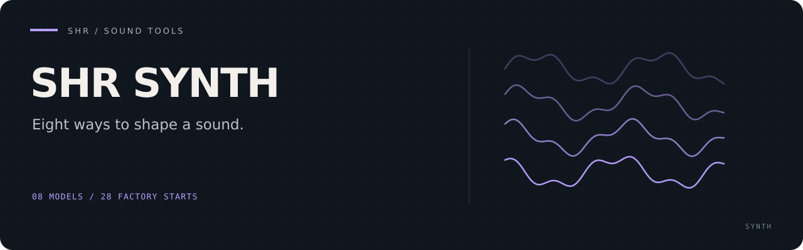

# SHR Synth

**Eight synthesis models, one headless instrument.** Explore bass, leads, metallic
FM, moving textures and acid lines through 28 editable factory presets.
Use the JACK/ALSA host with [SHR-DAW](https://github.com/PaolaShultz/shr-daw),
or validate presets and render WAVs entirely offline.

[Get started](#quick-start) · [Documentation](docs/README.md) · [Preset format](docs/PRESET_SCHEMA.md) · [Host contract](docs/HOST_CONTRACT.md)

## The sound engines

| Model | Starting point |
| --- | --- |
| Model D | Circuit-informed subtractive synthesis |
| Six-Op PM | Six-operator phase modulation |
| Strange Oscillator | Eight oscillator topologies |
| Swarm Machine | A layered warm-pad graph |
| Bass Matrix | Bass transformation |
| Dual Filter | Two filters, fifteen native values and two switchable cores |
| Pressure Chain | Three monophonic topologies |
| Open303 | Monophonic acid synthesis with accent and slide |

This is an experimental instrument. The factory presets are playable starting
points; the [preset and control schema](docs/PRESET_SCHEMA.md) owns the exact
model controls and SHR-DAW's 4×4 physical mapping.

## Quick start

Use the pinned Rust **1.97.1** toolchain, ALSA development headers
(`libasound2-dev` on Debian), and a C++17 compiler for the default Open303 model.
Live use also needs the JACK runtime.

```sh
cargo build --locked --release --bin shr-synth

# Check a preset and render a one-second WAV without audio hardware.
target/release/shr-synth validate presets/reference.mojsint
target/release/shr-synth render presets/reference.mojsint output.wav --note 60 --seconds 1
```

For live use, attach to an existing JACK server:

```sh
target/release/shr-synth --client-name shs-shr-synth --preset presets/reference.mojsint
```

The host exposes one ALSA MIDI input (`input`) and stereo JACK outputs
(`out_l`, `out_r`). It leaves port connections and JACK startup to the host.

## Install the host and factory presets

```sh
cargo install --path . --locked --bin shr-synth
install -d "$HOME/.local/share/shr-synth/presets"
while IFS= read -r preset; do
  install -m644 "presets/$preset" "$HOME/.local/share/shr-synth/presets/"
done < presets/cleared-presets.txt
```

SHR-DAW already searches that user preset directory. Its installer owns the
exact companion revision in its
[compatibility manifest](https://github.com/PaolaShultz/shr-daw/blob/main/install/compatibility.json).

## Go deeper

- [Architecture](docs/ARCHITECTURE.md) — the portable engine and live-host boundary
- [Documentation index](docs/README.md) — models, research and current contracts
- [Open303 integration](docs/OPEN303_INTEGRATION.md) — native controls and four factory starts
- [Development handoff](docs/HANDOFF.md) — decisions and validation evidence

<details>
<summary>Development checks</summary>

```sh
cargo fmt --check
cargo test --locked --all-targets --all-features
cargo clippy --locked --all-targets --all-features -- -D warnings
cargo build --locked --release --all-targets
```

Historical auditions and exhaustive evidence renderers are opt-in; see
[repository instructions](AGENTS.md).

</details>

Source and project-authored factory presets: [MIT](LICENSE).
[Third-party notices and cleared content](THIRD_PARTY.md).
